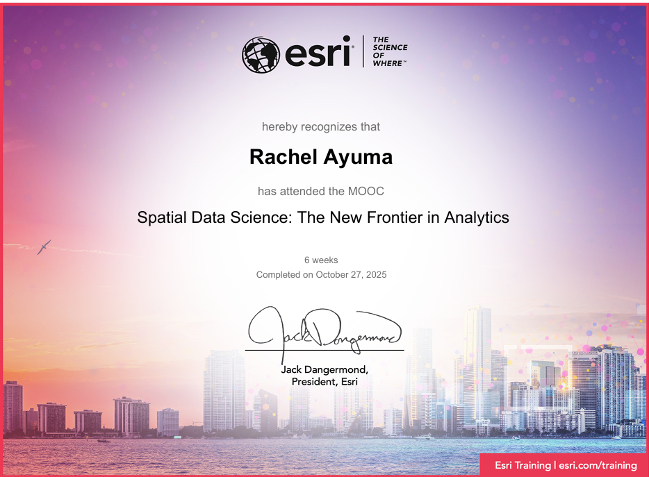

# Certifications

## Esri Spatial Data Science Certification

**Institution:** Esri  
**Focus Areas:** Spatial Data Science, GIS Analysis, Spatial Modeling, and Geospatial Workflows

This certification strengthened my skills in applying spatial data science techniques using GIS tools and geospatial analysis workflows for solving real-world spatial problems.

---

>
