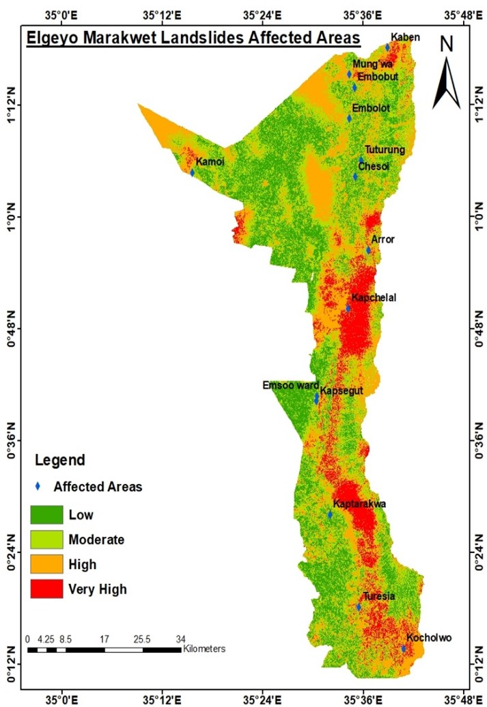

---
hide:
  - toc
  - navigation
---
<!--
CHECKLIST FOR THIS PAGE:
- [ ] Replace the two placeholder cards (marked [YOUR PROJECT ...]) with your real projects
- [ ] For each project: add a thumbnail image to docs/assets/images/ and update the path below
- [ ] For each project: create a project page by copying sample-project.md
- [ ] For each project: add a nav entry in mkdocs.yml (see the comments there)
- [ ] Delete placeholder cards you don't need yet
-->

# Projects

A selection of my geospatial projects. Click any card to see the full write-up.

**[Sample Project](sample-project.md)**

Developed a cross-regional transfer learning framework to map landslide susceptibility across two Kenyan counties, enabling reliable hazard prediction in data-scarce Elgeyo Marakwet by transferring a Support Vector Machine model trained on West Pokot — achieving 83% accuracy without any local retraining.
`[TOOL 1]` `[TOOL 2]` `[TOOL 3]`

[View Project →](sample-project.md){ .md-button }

**[Sample Notebook](sample-notebook.ipynb)**

[YOUR PROJECT DESCRIPTION — one or two sentences: what you did, what data you used,
and what you found or built.]

`Python` `pandas` `Folium`

[View Project →](sample-notebook.ipynb){ .md-button }

